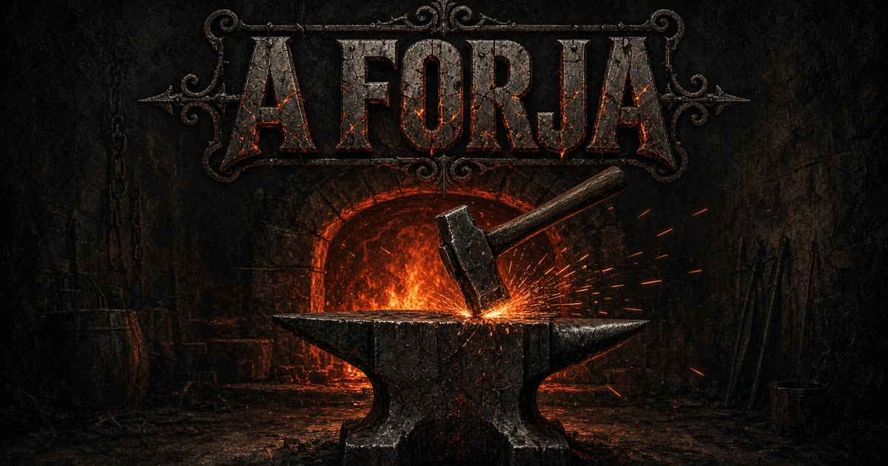

# FioForja

Jogo de forja medieval no navegador. Você desenha a espada, aquece o ferro, martela no ritmo certo e tempera o gume — a força de cada golpe decide se nasce uma obra-prima ou um ferro torto.



## Como jogar

1. **Desenhe a arma** — escolha perfil, aço, cabo, guarda, pomo e uma inscrição.
2. **Aqueça** — leve o metal à janela de cor certa (cada aço pede uma temperatura).
3. **Martele** — segure para carregar a força e solte no ponto doce. Golpe fraco não forma; golpe forte demais empena.
4. **Tempere** — mergulhe a lâmina na hora certa.
5. **Guarde** — a espada entra no arsenal com nota de qualidade.

### Controles

| Ação | Mouse / toque | Teclado |
|---|---|---|
| Aquecer / martelar / temperar | Segurar e soltar | Espaço ou clique |
| Reaquecer no meio da forja | Botão **Reaquecer** | `R` |
| Silenciar | Ícone de som | — |

No celular, tudo é por toque: segure para carregar o martelo, solte para bater.

## Oficina

**Perfis:** espada curta, longa, claymore, alfange, sabre.

**Aços:** ferro (perdoa erros), aço, damasco (janela estreita), meteorito (estrelas no gume).

**Cabo e ferro:** couro, linho, fio de ouro ou osso; guardas em cruz, curva, asas ou anel; pomos em disco, esfera, lobo ou cruz.

**Inscrição:** texto gravado no ricasso, com opção de runas.

A qualidade final soma calor, precisão dos golpes e têmpera. Espadas ficam salvas no navegador.

## Rodar localmente

```bash
npm install
npm run dev
```

Abre em `http://localhost:8080`.

```bash
npm run build      # produção
npm run typecheck  # tipos
```

## Stack

- React 19 + TypeScript
- TanStack Start / Router
- Vite 8 + Tailwind CSS 4
- Canvas 2D para a forja, a mão e a espada

Feito para o navegador — sem conta, sem servidor de jogo. O arsenal vive em `localStorage`.
